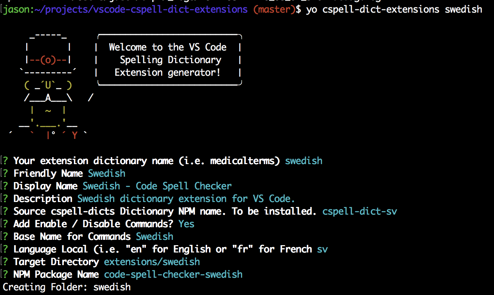

# Contributing

Contributions are very welcome.

## How to create a new extension

Please fork this repository to add new dictionaries.

### Using Yeoman script

The [Yeoman](http://yeoman.io/) script can help you create the dictionary template files seen in most of dictionary directories.

#### Install Yeoman

Install Yeoman and then link the generator.

```sh
npm install
npm install -g yo
cd generator-cspell-dicts-extensions
npm install
npm link
cd ..
```

#### Running the generator.

In the `vscode-cspell-dict-extensions` repository root.

```sh
yo cspell-dict-extensions <name>
```

##### Example Answers for Swedish



Yeoman will ask you a series of questions:

| Field                         | Description                                                                                                                                                                                                      |
| ----------------------------- | ---------------------------------------------------------------------------------------------------------------------------------------------------------------------------------------------------------------- |
| name                          | this is the dictionary. i.e. `swedish`, `ruby`, or `rust`                                                                                                                                                        |
| friendly name                 | this is the friendly name, like `Swedish`                                                                                                                                                                        |
| display name                  | this is the name shown on the VS Code Extensions page.                                                                                                                                                           |
| description                   | short description of the extension.                                                                                                                                                                              |
| Source Dictionary             | This is the NPM install name of the source dictionary                                                                                                                                                            |
| Add Enable / Disable Commands | This is used for adding helper commands for human language locals like `fr` for French or `fr,fr_CA` for Canadian French. This option is not necessary for word lists like `companies` or programming languages. |
| Base Name For Commands        | This is added as a suffix onto the command names.                                                                                                                                                                |
| Language Locale               | This is the two letter language code supported by the dictionary included in the `Source Dictionary` step.                                                                                                       |
| Target Directory              | Where to create the extension                                                                                                                                                                                    |
| NPM Package Name              | name added to the `package.json`                                                                                                                                                                                 |

After all the information is entered, the extension should be generated.

Please fix any errors and make sure the following two commands run:

```sh
cd extensions/<name>
npm install
npm run build
```

Please update `README.md`, `package.json` and `LICENSE` files as necessary.

## Licenses

Note: the preferred licenses are either MIT or GPL3.

The safest to use is GPL3, but it is the most sticky.

Since these extensions bundle the dictionary as part of the extension (falls under static linking clauses), the license must match the bundled dictionary / dictionaries.
If the bundled dictionary is GPL3, then the extension must be GPL3 or later.

## Testing Dictionary Extensions

### Open VS Code

```sh
code extensions/<name>
```

### Run

Within VS Code `Debug -> Start Debugging` with the `Launch Extension` configuration.
