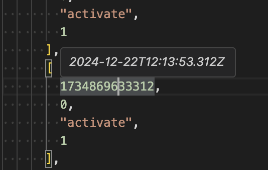

# Timestamp Hover

Display the ISO time and date while hovering over timestamps.

- Automatically converts timestamps from seconds, milliseconds, or microseconds to ISO Time.
- Does not coverts timestamps before 1980 to avoid being noisy.

